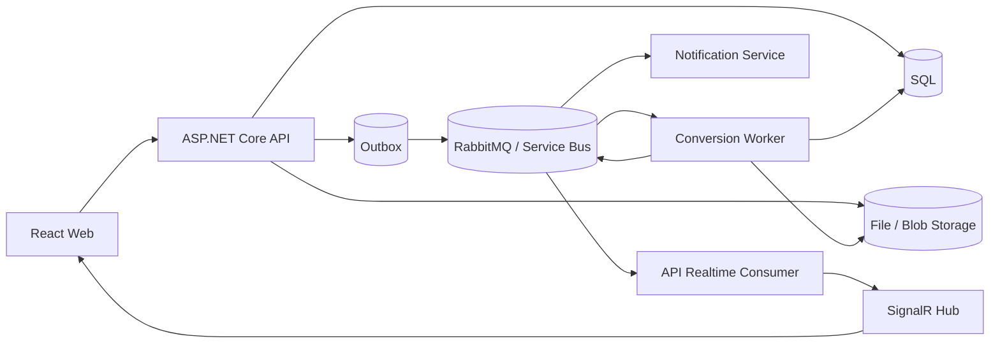
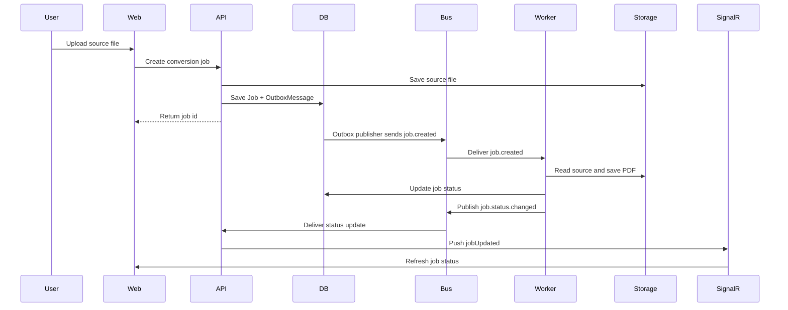

# Document Pipeline

Document Pipeline is a cloud-ready document processing system built with ASP.NET Core, React, background workers, RabbitMQ, SignalR, Outbox/Inbox reliability patterns, Terraform, and Azure deployment targets.

The application accepts source documents from a web client, creates asynchronous conversion jobs, processes them in background workers, streams job status to the browser, and exposes the generated PDF when processing completes.

## Core Capabilities

- Asynchronous document-to-PDF jobs with background workers.
- Realtime browser updates through SignalR.
- Outbox/Inbox reliability patterns for message publishing and consumption.
- Local development with SQL Server, RabbitMQ, and local file storage.
- Azure runtime model with Container Apps, Azure SQL, Blob Storage, Service Bus, Key Vault, and managed identity.
- Terraform infrastructure for `testbed` and `prod`.
- CI/CD flow for validation, testbed deployment, and image promotion.

Supported inputs: `jpg`, `jpeg`, `png`, `bmp`, `gif`, `webp`, `txt`, `md`, `html`, `htm`.

## Architecture



## Processing Flow



## Runtime Model

| Environment | Infrastructure |
| --- | --- |
| Development | SQL Server, RabbitMQ, local file storage |
| Testbed | Azure Container Apps, Azure SQL, Blob Storage, Service Bus, Key Vault |
| Production | same provider model as testbed with promoted container images |

## Run Locally

Start dependencies:

```powershell
docker compose up -d sqlserver rabbitmq
```

Run services:

```powershell
dotnet run --project src/CloudDocumentPipeline.Api
dotnet run --project src/CloudDocumentPipeline.Worker
dotnet run --project src/CloudDocumentPipeline.NotificationService
```

Run the web client:

```powershell
cd src/CloudDocumentPipeline.Web
npm install
npm run dev
```

Full containerized local stack:

```powershell
docker compose -f docker-compose.yml -f docker-compose.dev.yml up --build -d
```

## Project Structure

```text
src/CloudDocumentPipeline.Web                  React upload and job tracking UI
src/CloudDocumentPipeline.Api                  HTTP API, SignalR, health checks, result downloads
src/CloudDocumentPipeline.Worker               conversion processing, outbox publishing, stale recovery
src/CloudDocumentPipeline.NotificationService  secondary event consumer with inbox processing
src/CloudDocumentPipeline.Application          use cases, contracts, messaging DTOs
src/CloudDocumentPipeline.Domain               job, inbox, and outbox domain model
src/CloudDocumentPipeline.Infrastructure       EF Core, storage, messaging, metrics
infra/                                         Terraform environments
```

## Verify

```powershell
dotnet build CloudDocumentPipeline.sln
```

Additional documentation:

- [Architecture](docs/architecture.md)
- [System Flow](docs/system-flow.md)
- [Release Runbook](docs/release-runbook.md)
- [CI/CD and Cloud Plan](docs/cicd-cloud-plan.md)
- [Terraform Notes](infra/README.md)
