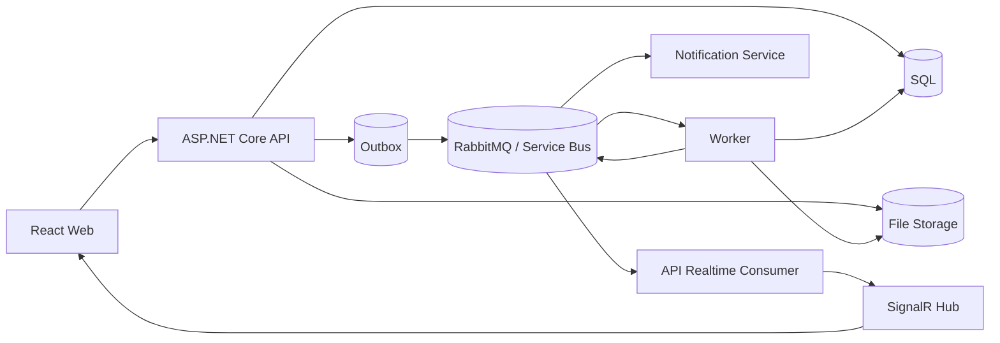

# DocFlowCloud

DocFlowCloud is an asynchronous document-to-PDF platform. It accepts source files from a web client, creates background conversion jobs, streams job status updates in real time, and exposes the generated PDF for download when processing completes.

The project is built as a production-oriented .NET and React system, with local RabbitMQ development, Azure Service Bus cloud messaging, Outbox / Inbox reliability patterns, Terraform infrastructure, and GitHub Actions based image promotion.

## Key Features

- async document-to-PDF jobs with background workers
- realtime browser updates through SignalR
- Outbox / Inbox based message reliability and idempotency
- local development with SQL Server, RabbitMQ, and local file storage
- Azure runtime model with Container Apps, Azure SQL, Blob Storage, Service Bus, and Key Vault
- Terraform infrastructure for `testbed` and `prod`
- CI/CD flow that validates PRs, deploys `testbed`, and promotes validated images to production

Supported inputs:

- images: `jpg`, `jpeg`, `png`, `bmp`, `gif`, `webp`
- text: `txt`
- markdown: `md`
- html: `html`, `htm`

## Architecture



## Processing Flow


## Main Components

- `src/DocFlowCloud.Web` - React client for uploads, job tracking, realtime updates, and PDF downloads
- `src/DocFlowCloud.Api` - HTTP API, SignalR hub, job queries, result downloads, and health endpoints
- `src/DocFlowCloud.Worker` - job processing, PDF generation, outbox publishing, retries, and stale recovery
- `src/DocFlowCloud.NotificationService` - secondary event consumer with inbox-based processing
- `src/DocFlowCloud.Application` - use cases, contracts, messaging DTOs, and application abstractions
- `src/DocFlowCloud.Domain` - job state model, inbox and outbox entities, and domain rules
- `src/DocFlowCloud.Infrastructure` - EF Core persistence, storage providers, messaging providers, and metrics

## Runtime Model

`Development` uses SQL Server, RabbitMQ, and local file storage.

`Testbed` and `Production` use Azure Container Apps, Azure SQL, Azure Blob Storage, Azure Service Bus, Key Vault, managed identities, and a one-off migrator job. The same application code switches providers through environment configuration.

## Local Run

Start the local dependencies:

```powershell
docker compose up -d sqlserver rabbitmq
```

Run the services:

```powershell
dotnet run --project src/DocFlowCloud.Api
dotnet run --project src/DocFlowCloud.Worker
dotnet run --project src/DocFlowCloud.NotificationService
```

Run the web client:

```powershell
cd src/DocFlowCloud.Web
npm install
npm run dev
```

For a full containerized local stack:

```powershell
docker compose -f docker-compose.yml -f docker-compose.dev.yml up --build -d
```

## Delivery

Pull requests run build and test checks. Pushes to `test` build images, push them to GHCR, run the migrator when needed, and deploy the testbed environment. Production is promoted manually by selecting an image tag that was already validated in testbed.

Infrastructure changes are handled separately through Terraform validation workflows. Detailed deployment and rollback steps live in the release runbook.

## Observability

The platform includes structured Serilog logs, health endpoints, job lifecycle metrics, and a baseline OpenTelemetry trace setup for API, worker, and notification processing.

Health endpoints:

- `/health`
- `/health/live`
- `/health/ready`

## Documentation

- [Architecture](docs/architecture.md)
- [System Flow](docs/system-flow.md)
- [State Diagrams](docs/state-diagrams.md)
- [Release Runbook](docs/release-runbook.md)
- [CI/CD And Cloud Plan](docs/cicd-cloud-plan.md)
- [Terraform Notes](infra/README.md)
