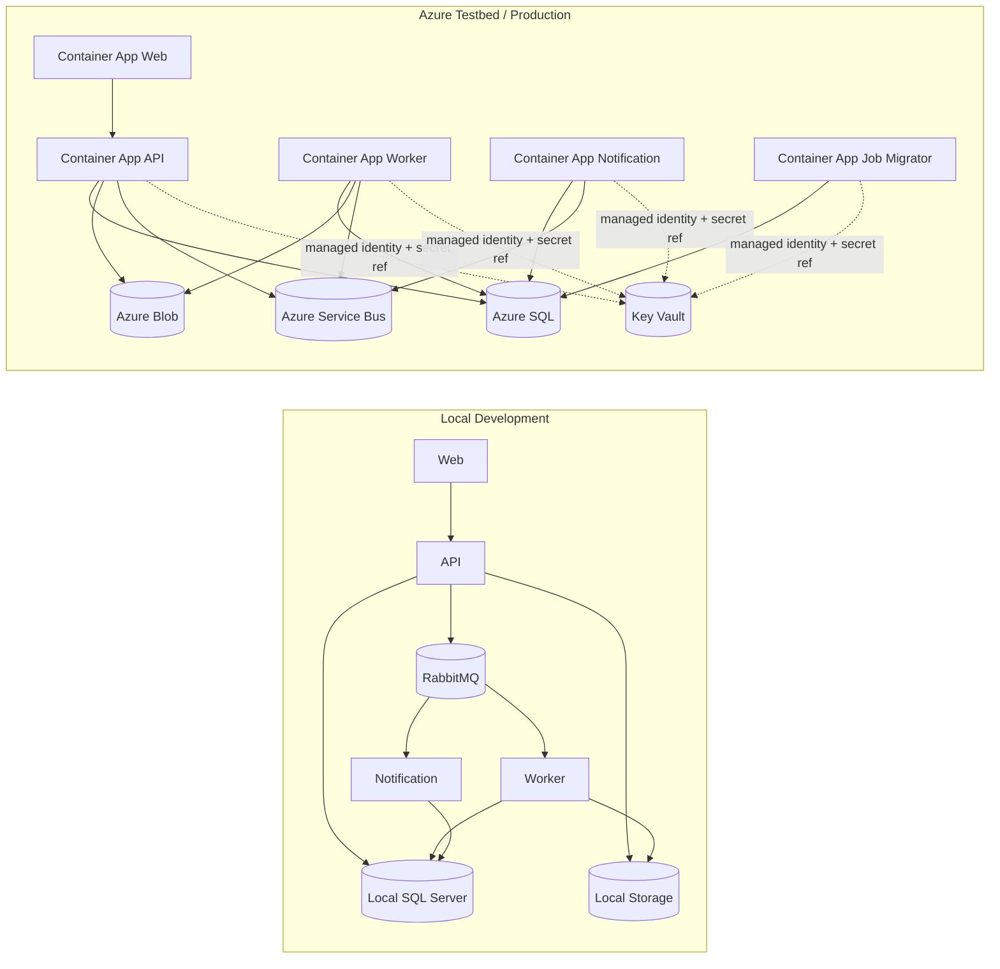
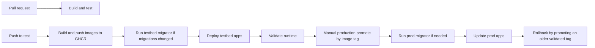

# DocFlowCloud

DocFlowCloud is an asynchronous document processing platform for uploading source files, creating background conversion jobs, tracking status in real time, and downloading generated PDF results.

The solution includes a production-oriented delivery stack with:

- React + TypeScript frontend
- ASP.NET Core API and background services
- local RabbitMQ development flow
- cloud Azure Service Bus flow
- Outbox / Inbox reliability patterns
- SignalR realtime updates
- Azure SQL, Blob, Key Vault, and Container Apps
- GitHub Actions + GHCR promotion pipeline
- Terraform-based Azure infrastructure definition
- split app / infra workflows

## Highlights

- asynchronous document-to-PDF processing with background workers
- realtime job tracking in the browser via SignalR
- local development flow and Azure cloud runtime model
- CI/CD image promotion with Terraform-managed infrastructure

## What It Does

DocFlowCloud supports the full document processing flow:

1. Upload one or more source files from the web client
2. Create asynchronous conversion jobs through the API
3. Process conversions in background workers
4. Stream job status updates back to the browser in real time
5. Download the generated PDF output when processing completes

Supported inputs:

- images: `jpg`, `jpeg`, `png`, `bmp`, `gif`, `webp`
- text: `txt`
- markdown: `md`
- html: `html`, `htm`

## System Overview



## Delivery Model



## Observability Baseline

- structured Serilog console logs in `Testbed` and `Production`
- key business logs for job lifecycle
- API health endpoints:
  - `/health`
  - `/health/live`
  - `/health/ready`
- basic metrics instrumentation:
  - `jobs_created_total`
  - `jobs_succeeded_total`
  - `jobs_failed_total`
  - `jobs_retried_total`
  - `job_processing_duration_seconds`
- minimal OpenTelemetry tracing baseline for:
  - job creation
  - worker side-effect execution
  - notification processing

## Infrastructure As Code

Terraform now defines the Azure runtime shape with separate root modules for:

- `infra/environments/testbed`
- `infra/environments/prod`

Current Terraform coverage:

- resource group
- log analytics workspace
- container apps environment
- SQL server and database
- storage account and blob container
- service bus namespace, topic, and subscriptions
- key vault
- container apps:
  - api
  - web
  - worker
  - notification
- container app job:
  - migrator
- managed identity, Key Vault secret references, and GHCR registry auth
- image drift intentionally ignored in Terraform so CI/CD remains the image source of truth
- `testbed` imported and aligned to Azure with `terraform plan => No changes`
- `prod` prepared as create-from-scratch infrastructure with clean `terraform plan`

## Main Components

- `src/DocFlowCloud.Web`
  - browser client for upload, job tracking, and PDF download
- `src/DocFlowCloud.Api`
  - HTTP API, SignalR hub, status queries, and health endpoints
- `src/DocFlowCloud.Worker`
  - background processing, outbox publishing, retry handling, and stale recovery
- `src/DocFlowCloud.NotificationService`
  - event-driven notification and secondary message consumption
- `src/DocFlowCloud.Application`
  - application use cases, contracts, and observability abstractions
- `src/DocFlowCloud.Domain`
  - domain entities, state transitions, and inbox / outbox models
- `src/DocFlowCloud.Infrastructure`
  - persistence, messaging providers, storage integrations, and metrics implementation

## Environments

- `Development`
  - local Docker / IDE workflow
  - RabbitMQ
  - local file storage
- `Testbed`
  - Azure cloud pre-production
  - automatic image deployment from `test`
  - Azure Service Bus, Blob, SQL, Key Vault, Container Apps
- `Production`
  - Azure cloud production
  - manual promotion by validated image tag
  - same runtime shape as testbed

## Local Run

### Option A: day-to-day development

```powershell
docker compose up -d sqlserver rabbitmq
dotnet run --project src/DocFlowCloud.Api
dotnet run --project src/DocFlowCloud.Worker
dotnet run --project src/DocFlowCloud.NotificationService
cd src/DocFlowCloud.Web
npm install
npm run dev
```

### Option B: full local development stack

```powershell
docker compose -f docker-compose.yml -f docker-compose.dev.yml up --build -d
```

### Option C: local testbed simulation

```powershell
docker compose -f docker-compose.yml -f docker-compose.testbed.yml up --build -d
```

## Docs

- [Architecture](docs/architecture.md)
- [System Flow](docs/system-flow.md)
- [State Diagrams](docs/state-diagrams.md)
- [Release Runbook](docs/release-runbook.md)
- [CI/CD And Cloud Plan](docs/cicd-cloud-plan.md)
- [Terraform Notes](infra/README.md)

## Platform Capabilities

- asynchronous document processing with background job orchestration
- local and Azure runtime support with environment-specific messaging and storage providers
- realtime browser updates through SignalR
- reliability patterns including Outbox / Inbox, retry handling, stale recovery, and DLQ support
- split application and infrastructure delivery workflows
- structured logging, health checks, metrics, and tracing baseline
- Terraform-defined Azure infrastructure for testbed and production environments

## Deployment Status

- `testbed` infrastructure is represented in Terraform and aligned to Azure with zero-drift planning
- `prod` environment definition is prepared with the same runtime shape for controlled promotion
