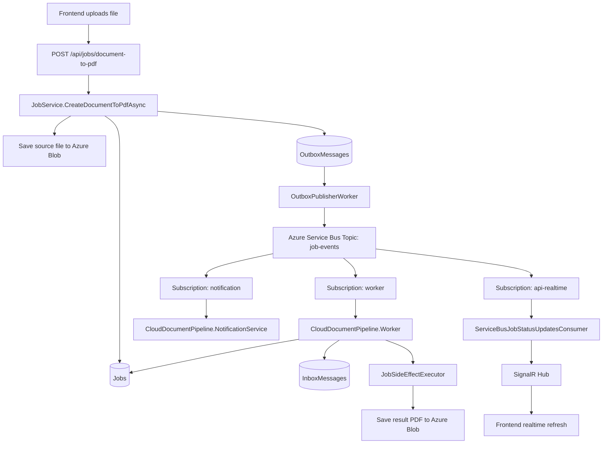
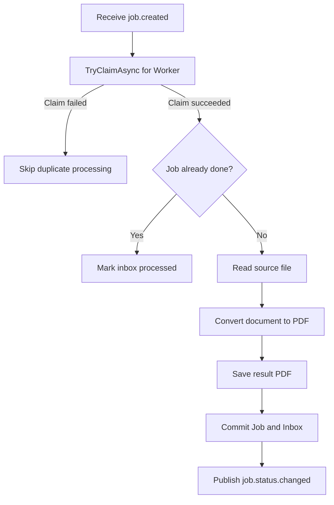
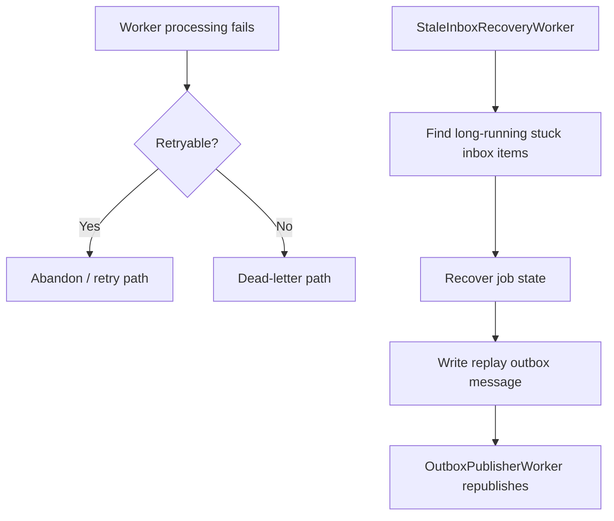
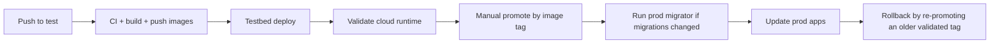

# System Flow

This document describes the current end-to-end async flow in `CloudDocumentPipeline`.

## Environment Split

- local `Development`
  - RabbitMQ
  - local storage
- cloud `Testbed`
  - Azure Service Bus
  - Azure Blob
  - Azure Container Apps
- cloud `Production`
  - same runtime shape as testbed
  - promotes validated image tags

## Cloud Main Flow

## End-to-End Processing

1. The frontend uploads an image, text, markdown, or HTML file.
2. The API calls `JobService.CreateDocumentToPdfAsync(...)`.
3. The source file is written to the configured storage provider.
4. The API writes both:
   - a `Job`
   - an `OutboxMessage`
5. `OutboxPublisherWorker` publishes `job.created` to the `job-events` topic.
6. The `worker` subscription is consumed by `CloudDocumentPipeline.Worker`.
7. The `notification` subscription is consumed by `CloudDocumentPipeline.NotificationService`.
8. The worker loads the source file and performs the conversion.
9. The worker saves the generated PDF and updates `Job` + `InboxMessage`.
10. The worker publishes `job.status.changed`.
11. The `api-realtime` subscription is consumed by the API realtime consumer.
12. The API sends `jobUpdated` through SignalR so the browser refreshes status.

## Worker Consumption Flow

## Failure and Recovery

## Promotion Flow

